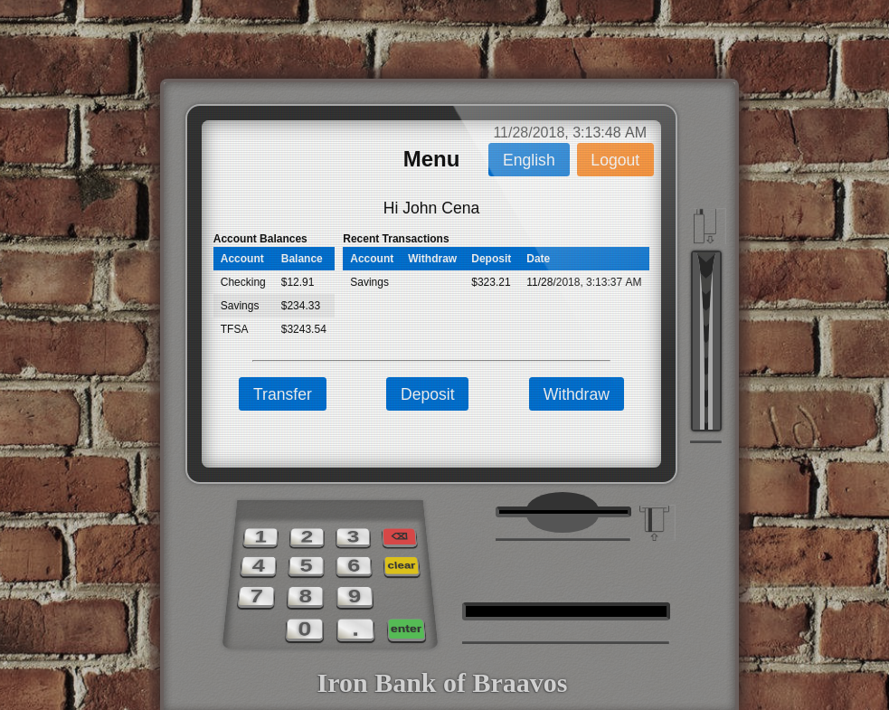

# Aweston - An ATM Simulator

The purpose of Aweston is to demonstrate the application of HCI principles, such as those
proposed by Donald Norman, towards the design of an ATM and improve the overall user
experience.

---

